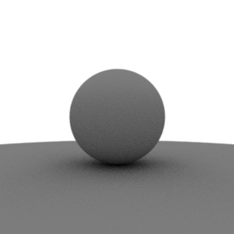

# Simple Ray Tracing in C

A basic ray tracer written in C that renders spheres with simple diffuse shading. The output is a PPM image file.

## Features
- Ray-sphere intersection
- Diffuse shading
- Multiple spheres
- Outputs to PNG format

## Usage
1. Compile the code:
   ```bash
   ./build.sh
   ```
2. Run the program:
   ```bash
   ./raytracer
   ```
3. View the generated `output.png` file.

## Customization
Modify sphere positions, colors, and the light source in `raytracer.c` to change the scene.

## License
This project is licensed under the MIT License.

## Sample renders


